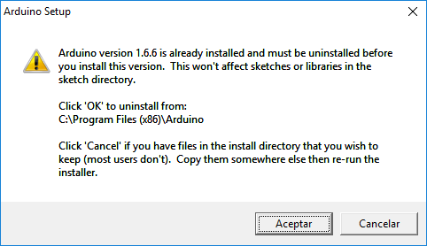
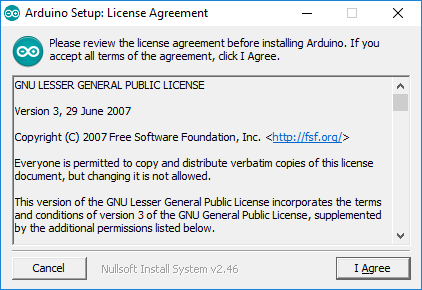
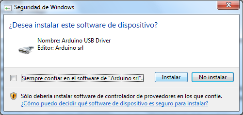

# INSTALAR ARDUINO

## INSTALAR IDE

Existen varios IDEs para trabajar con Arduino, como NETBEAM, Platformio,
etc, pero como iniciación es recomendable trabajar con el proporcionado
por Arduino.

### WINDOWS

Descargar la última versión del IDE de Arduino desde:
[http://arduino.cc/en/Main/Software](http://arduino.cc/en/Main/Software).

Elegir la opción de **Windows Installer**, aunque también es posible
descargar la versión comprimida en zip.

Ejecutar el instalador descargado. Si existe una versión anterior el
instalador nos avisa y nos desinstala. En el caso que hayamos hecho
modificaciones en el directorio de instalación las perderemos.

Aceptamos el acuerdo de licencia.

### MAC OS

Descargar la ultima versión de Arduino IDE en
[http://arduino.cc/en/Main/Software](http://arduino.cc/en/Main/Software) y
descargaremos un fichero .zip, el cual sera descomprimido automáticamente o
manualmente dependiendo de la configuración del safari.

### LINUX

Descargar la ultima versión de Arduino IDE de
[http://arduino.cc/en/Main/Software](http://arduino.cc/en/Main/Software).
Se deberá de escoger entre nuestra versión 32, 64 bits o ARM y descargar el
fichero. Extraeremos el fichero en la carpeta escogida recordando que sera
ejecutado el IDE desde aquí.

Abrir la carpeta creada en la extracción y hacer click con el botón
derecho al fichero instalar y escogemos Run in Terminal.

Otra manera es abriendo el terminal y abrir la carpeta creada. Teclear
el comando ./instal.sh y esperar a que el proceso termine. Se debería de
encontrar un nuevo icono en el escritorio.

Puede ser que cuando carguemos un *sketch* a nuestro arruino nos salga un error
**Error opening serial port...**. Probablemente es porque no tienes permisos
para abrir el puerto serie. En Ubuntu eso se soluciona añadiendo el usuario
actual (el que usamos para acceder al sistema) al grupo **dialout**:

    sudo usermod -aG dialout $USER

Y después salimos de la sesión y entramos de nuevo. No basta con salir sólo del
terminal.

Otro problema frecuente en Ubuntu es que el servicio **modemmanager** abre
automáticamente los puertos serie e interfiere con el IDE de Arduino cuando
éste accede al puerto serie. Si no lo necesitamos (muy probablemente no), podemos
desinstalarlo:

    sudo apt remove modemmanager
